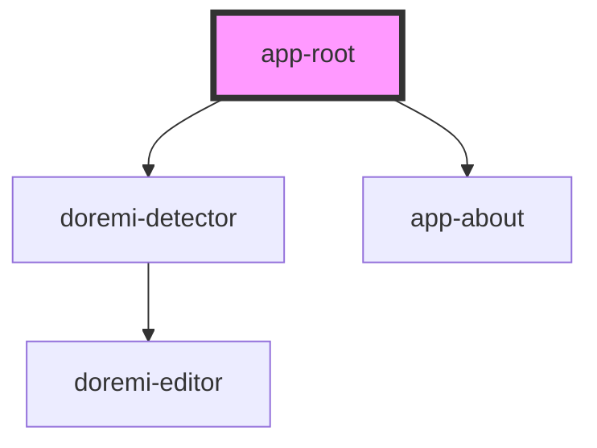

# app-root

<!-- Auto Generated Below -->

## Methods

### `update() => Promise<void>`

#### Returns

Type: `Promise<void>`

## Shadow Parts

| Part                   | Description |
| ---------------------- | ----------- |
| `"browse"`             |             |
| `"controls"`           |             |
| `"controls-container"` |             |
| `"drop"`               |             |

## Dependencies

### Depends on

- [doremi-detector](../detector)
- [app-about](../app-about)

### Graph

----------------------------------------------

*Built with [StencilJS](https://stenciljs.com/)*
