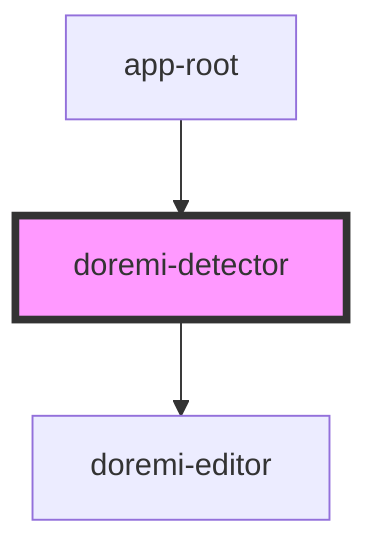

# doremi-detector

<!-- Auto Generated Below -->

## Properties

| Property    | Attribute    | Description | Type      | Default |
| ----------- | ------------ | ----------- | --------- | ------- |
| `loading`   | `loading`    |             | `boolean` | `false` |
| `showFrame` | `show-frame` |             | `boolean` | `false` |
| `src`       | `src`        |             | `string`  | `''`    |

## Events

| Event             | Description                      | Type               |
| ----------------- | -------------------------------- | ------------------ |
| `detectorError`   | Emitted when an error occurred.  | `CustomEvent<any>` |
| `loadingChange`   | Emitted when loading changes.    | `CustomEvent<any>` |
| `showFrameChange` | Emitted when show-frame changes. | `CustomEvent<any>` |
| `srcChange`       | Emitted when src changes.        | `CustomEvent<any>` |

## Methods

### `addCover() => Promise<void>`

#### Returns

Type: `Promise<void>`

### `deleteCover() => Promise<void>`

#### Returns

Type: `Promise<void>`

### `exportImage() => Promise<Blob>`

#### Returns

Type: `Promise<Blob>`

### `update() => Promise<void>`

#### Returns

Type: `Promise<void>`

## Shadow Parts

| Part     | Description |
| -------- | ----------- |
| `"base"` |             |

## Dependencies

### Used by

 - [app-root](../app-root)

### Depends on

- [doremi-editor](../editor)

### Graph

----------------------------------------------

*Built with [StencilJS](https://stenciljs.com/)*
