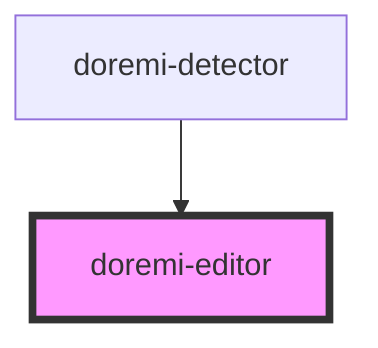

# doremi-editor

<!-- Auto Generated Below -->

## Properties

| Property | Attribute | Description | Type     | Default |
| -------- | --------- | ----------- | -------- | ------- |
| `height` | `height`  |             | `number` | `0`     |
| `pid`    | `pid`     |             | `number` | `0`     |
| `width`  | `width`   |             | `number` | `0`     |

## Methods

### `addCover() => Promise<void>`

#### Returns

Type: `Promise<void>`

### `deleteCover() => Promise<void>`

#### Returns

Type: `Promise<void>`

### `setData(data: any) => Promise<void>`

#### Returns

Type: `Promise<void>`

### `update() => Promise<void>`

#### Returns

Type: `Promise<void>`

## Dependencies

### Used by

 - [doremi-detector](../detector)

### Graph

----------------------------------------------

*Built with [StencilJS](https://stenciljs.com/)*
